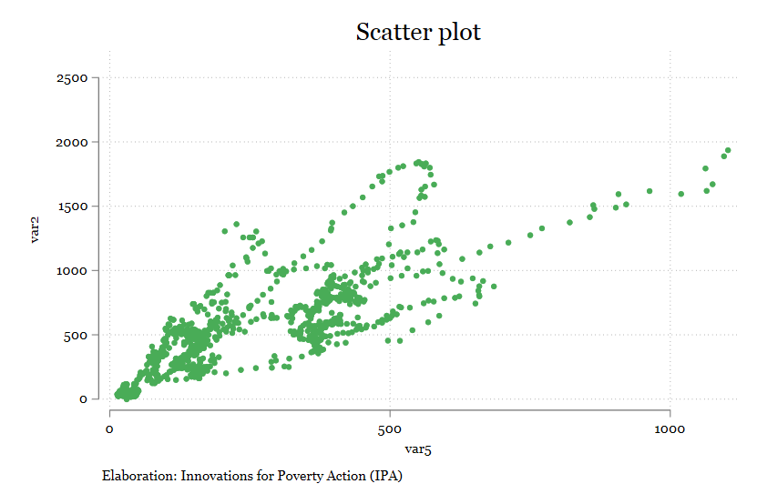
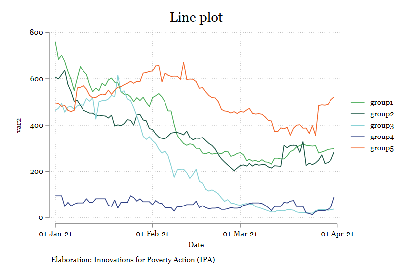
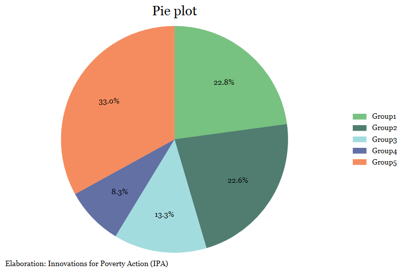
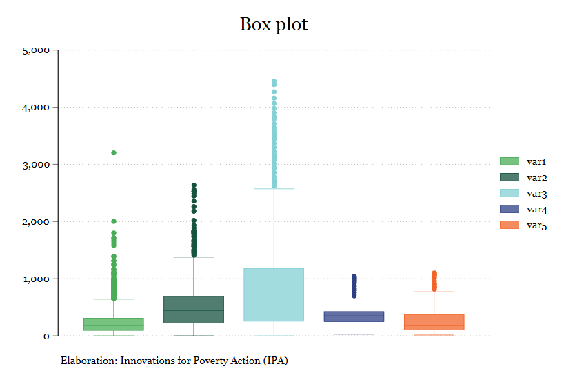
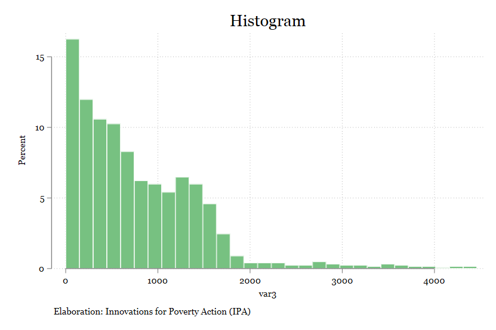
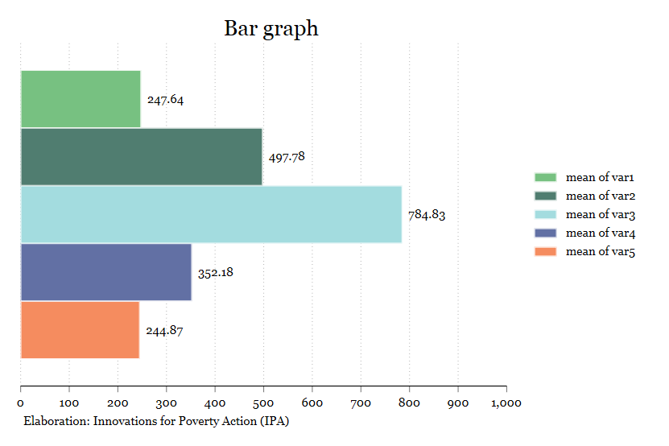
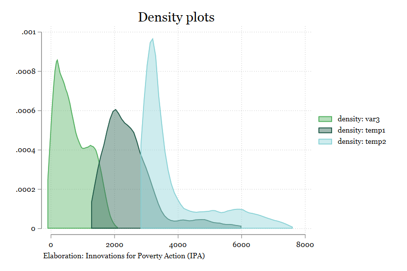
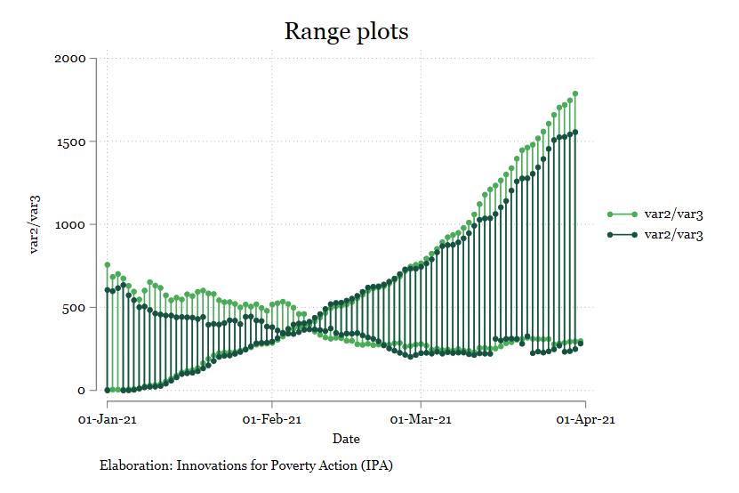
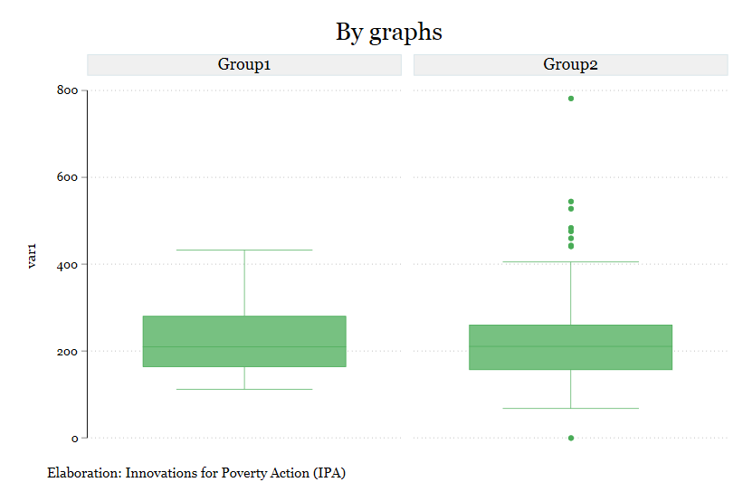

## ipaplots

Description: Stata scheme of Innovations for Poverty Action (IPA).

## Installation
 ```
net install github, from("https://haghish.github.io/github/")
github install PovertyAction/ipaplots

set scheme ipaplots
```

# Overview
 
 
 
 


## Authors
Innovations for Poverty Action, Peru ([Ronny Condor](https://www.poverty-action.org/people/ronny-condor) and [Kelly Montaño](https://www.poverty-action.org/people/kelly-monta%C3%B1o))
